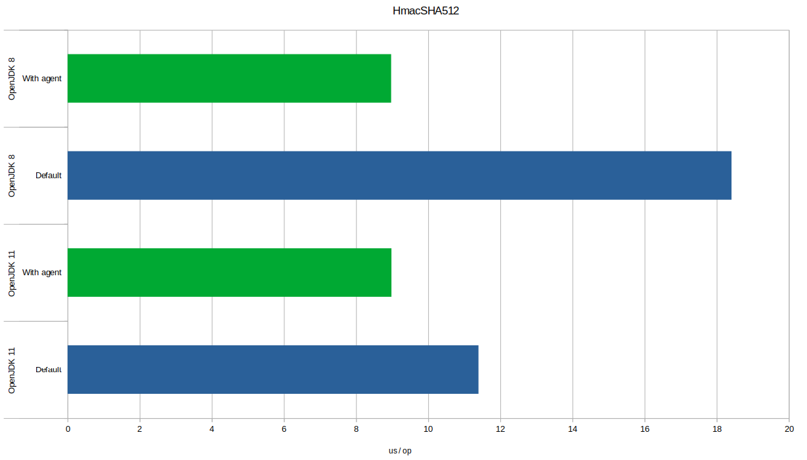

# jcrypto-agent


## Accelerate your Java crypto performance with no code changes

**jcrypto-agent** installs accelerated cryptography provider to JVM at application starting time.
It is a Java agent that runs before your application, and is installed by adding a Java command line option.
This means your application's crypto performance can be improved without needing code changes, requiring rebuilds, or having to maintain build variations for different platforms.
If the agent causes compatibility issues, for example after installing distro updates, it can be removed just as easily.

The agent installs the [Amazon Corretto Crypto Provider (ACCP)](https://github.com/corretto/amazon-corretto-crypto-provider) cryptography provider.
This replaces Java cryptography algorithms with those wrapped from the natively compiled [OpenSSL](https://www.openssl.org/) cryptography library.
Native code then uses CPU instructions for hardware-accelerated crypto.
The performance gains and reduced energy usage vary by application and its use of crypto algorithms.

The agent also performs safety checks, making sure the crypto provider is compatible with your platform.

## Usage

### Requirements

Agent requires the following environment to enable accelerated cryptography:

 - Java 8 or newer runtime
 - Linux operating system
 - glibc C-library
 - x86_64 architecture

The use of libc prevents the use of non-libc based distributions, such as Alpine Linux.

ARM architecture support will be added with runtime linking when this becomes generally available in ACCP.

### Build (optional) 

Build this agent requires JDK 8 or newer and Maven. Build by using:

```sh
$ mvn package
```

The resulting agent JAR is in `target/` path.


### Download

Download the current versoin [jcrypto-agent-0.20201213.jar](https://github.com/jkataja/jcrypto-agent/releases/download/v0.20201213/jcrypto-agent-0.20201213.jar) or using:

```sh
$ wget https://github.com/jkataja/jcrypto-agent/releases/download/v0.20201213/jcrypto-agent-0.20201213.jar
```

Donwload other versions and older versoins from [releases page](https://github.com/jkataja/jcrypto-agent/releases).

### Install

To install the agent, add the `-javaagent` argument to your JVM command line arguments.
Specify path to the agent JAR with version.
For example:

```sh
-javaagent:jcrypto-agent-0.20201213.jar
```

The agent runs before your application's `main` method, configuring ACCP as the crypto provider.
It then verifies that ACCP is installed as the highest priority crypto provider.
Optionally, add the `assert` option to agent options e.g. `-javaagent:jcrypto-agent-0.20201213.jar=assert` to also assert the installation is successful or throw an exception.
Without this option, the crypto provider will grafecully fall back to the default provider.

## Benchmarking

The following barchart shows **jcrypto-agent** effect on performace when measured by the runtime of`HmacSHA512` message authentication algorithm with 1024 bytes size input,
against default crypto provider,
and when running on OpenJDK 8 and OpenJDK 11 respectively.
Units are us/op, where lower is better



In this case, runtime of the algorithm was **reduced by over 50%** on OpenJDK 8,
while runtime on was **reduced by 20%** on OpenJDK 11.
Applications that use crypto extensively should see the highest performance improvements, for example when terminating TLS connections.
Your mileage may vary.

Benchmarks code was based on [GitHub repo ecki/jmhbench-cryptospeed](https://github.com/ecki/jmhbench-cryptospeed) that times crypto primitives on Java.
The code was modified by removing the other alternative crypto providers from benchamar runs.
The tests were run on ThinkPad T480 with Intel i5-8350U CPU, running Fedora 32 and either OpenJDK 11.0.9 or OpenJDK 1.8.0_272.

## Resources

 - [GitHub repo corretto/amazon-corretto-crypto-provider](https://github.com/corretto/amazon-corretto-crypto-provider)
 - [GitHub repo openssl/openssl](https://github.com/openssl/openssl)
 - [OpenSSL](https://www.openssl.org/) TLS/SSL and crypto library

## Meta

Janne Kataja – [@jkataja](https://twitter.com/jkataja) – fistname.lastname at gmail

GitHub [jkataja/jcrypto-agent](https://github.com/jkataja/jcrypto-agent)

This software is provided "as is", without warranty of any kind.

Distributed under the Apache License v2 license. See ``LICENSE`` for more information.

This software contains [Amazon Corretto Crypto Provider](https://github.com/corretto/amazon-corretto-crypto-provider), licensed under the Apache License v2 and 
portions licensed under the dual OpenSSL and SSLeay license, specifically this includes software developed by the OpenSSL Project for use in the [OpenSSL Toolkit](https://www.openssl.org) and this product also includes cryptographic software written by Eric Young (eay@cryptsoft.com).
